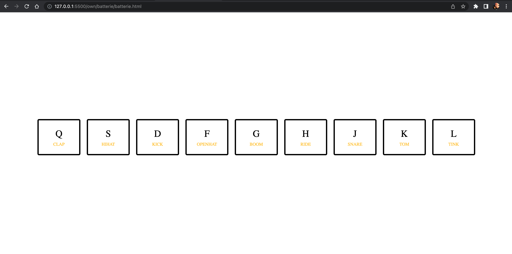
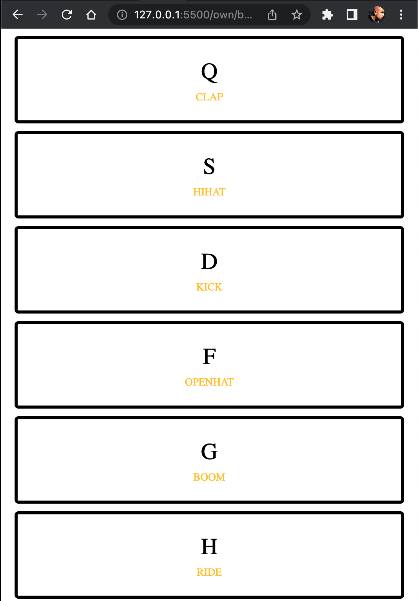
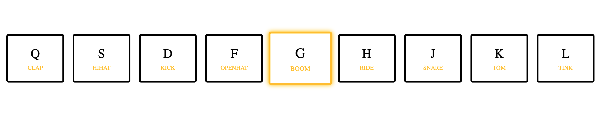

# TP Batterie 🎶

Dans cet exercice, nous allons jouer un son particulier quand l'utilisateur presse une touche visible à l'écran. La couleur de fond devra changer pendant un bref instant.

## Etape Github

Vous allez créer un dépôt Github pour versionner le projet. A chaque étape de réalisation, vous réaliserez des commits. N'oubliez que plus il y a des commits, mieux c'est pour l'historique du projet.

## Etape HTML / CSS

La première chose va être d'intégrer la maquette suivante :

Il y a également une version responsive :

Voici la maquette avec l'état playing sur une touche :

## Etape JavaScript

Pour le JavaScript, voici la liste des étapes à réaliser :

- La première étape va être d'écouter la saisie sur n'importe quelle touche de la part de l'utilisateur
- Si c'est le cas, il faut pouvoir trouver la balise audio associée puis lancer la lecture en vous aidant de [cela](https://developer.mozilla.org/fr/docs/Web/API/HTMLMediaElement/play)). Vous avez le droit de positionner les balises audio dans le HTML à l'avance. Il faudra simplement sélectionner la bonne balise en JS et appliquer la méthode `play()` sur celle-ci. On devra sûrement remettre le player à 0 entre chaque clic.
- Il faudra également ajouter la classe CSS `playing` qui appliquera un CSS particulier et il faudra enlever la classe à la fin. Pour enlever la classe, on devra lui définir une durée de transition dans le CSS puis écouter l'événemenent `transitionend` en JS afin d'enlever la classe.
- Changer la couleur de fond du body en ajoutant une classe qui porte le nom de la touche par exemple. Exemple: on ajoute la classe a si on appuie sur a. Il faudra enlever la classe de la même manière que pour `playing`.
- Ajouter la possibilité de faire les actions au clic. Vous pouvez vous servir de l'attribut [data-*](https://developer.mozilla.org/fr/docs/Web/HTML/Attributs_universels/data-*) pour savoir sur quelle touche vous cliquez.

## Eléments

Couleurs du body :

- s : #33658a
- d : #fd5200
- f : #2f4858
- g : #f6ae2d
- h : #4381c1
- k : #822e81
- j : #f593e0
- q : #568259
- l : #8cd790
